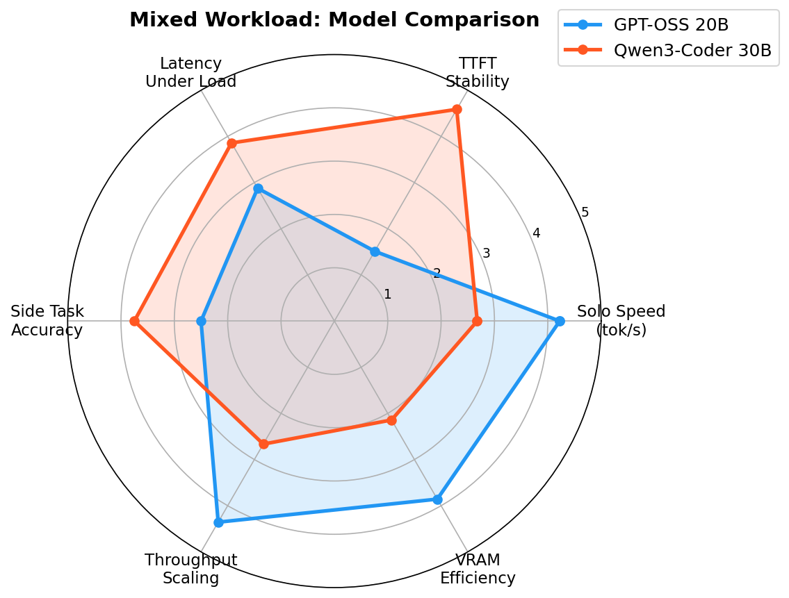
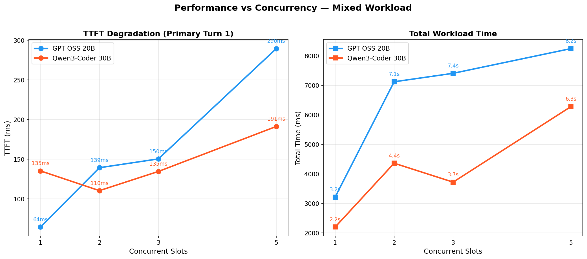
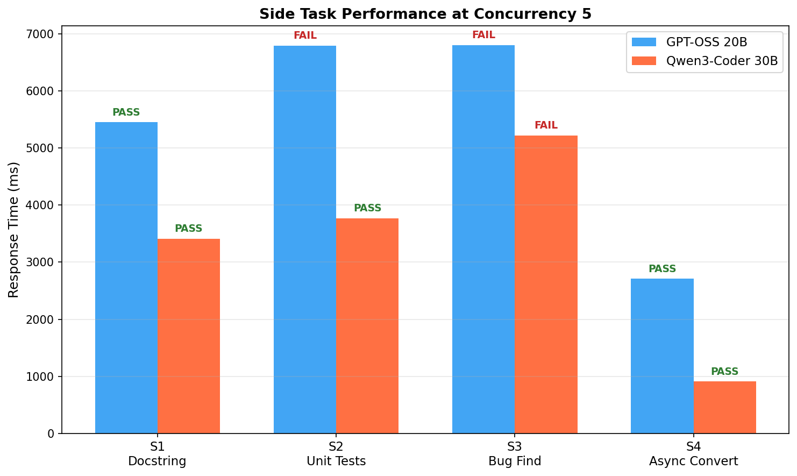

# Mixed Workload Benchmark: Quality vs Concurrency

**Date:** 2026-02-22
**Hardware:** RTX 4090 (24GB VRAM)
**Test:** Mixed workload — primary multi-turn coding task + concurrent side tasks

---

## Motivation

The [v1/v2 multi-agent benchmark](../20260214_multi_agent/) tested 5 identical
agents analyzing the same bug. That doesn't reflect daily use. In practice,
you run one heavy coding session (Claude Code delegating to a local model)
while shorter requests (docstrings, quick tests, reviews) fire in parallel.

This benchmark measures **quality degradation as concurrency increases** on
realistic, heterogeneous tasks.

---

## Models Under Test

| Model | Preset | VRAM | Context | Parallel Slots |
|-------|--------|------|---------|----------------|
| GPT-OSS 20B MoE | `gpt-oss-20b-multi` | 14 GB | 40K (8K×5) | 5 |
| Qwen3-Coder 30B-A3B | `qwen3-coder-multi` | 20 GB | 40K (8K×5) | 5 |

Both use llama.cpp with `--parallel 5 --cont-batching --threads 16`.

---

## Workload Design

### Primary Task (P1): Multi-turn FastAPI Implementation

A 3-turn conversation simulating Claude Code asking a local model to build
an API endpoint incrementally:

| Turn | Prompt | Expected Output |
|------|--------|-----------------|
| 1 | Create `POST /users` with Pydantic validation, UUID, 201 response | Complete runnable FastAPI code |
| 2 | Add email/age/name validation, 422 errors | Updated Pydantic model |
| 3 | Add `GET /users/{user_id}` with dict storage, 404 handling | New endpoint + storage dict |

### Side Tasks (S1–S4): Concurrent Short Requests

| ID | Task | Context | Verification |
|----|------|---------|--------------|
| S1 | Write Google-style docstring for `binary_search()` | ~500 tok | Keywords: sorted, index, target, Args, Returns |
| S2 | Write 3 pytest tests for `calculate_discount()` | ~1K tok | Keywords: def test_, pytest, assert |
| S3 | Find off-by-one bug in pagination function | ~800 tok | Keywords: ceil, last page, remainder |
| S4 | Convert sync file reader to async with aiofiles | ~1K tok | Keywords: async def, await, aiofiles |

### Concurrency Levels

| Level | Active Slots | Description |
|-------|-------------|-------------|
| 1 | P1 only | Baseline — no contention |
| 2 | P1 + S1 | Light side task |
| 3 | P1 + S1 + S2 | Medium load |
| 5 | P1 + S1–S4 | Full slots |

Temperature: 0.2 for all requests. Max tokens: 1024 (primary), 512 (side).

---

## Charts

### Radar: Model Comparison



Qwen3-Coder 30B dominates on TTFT stability, latency under load, and side
task accuracy. GPT-OSS 20B wins on raw solo speed and VRAM efficiency (14GB
vs 20GB).

### Degradation: Performance vs Concurrency



GPT-OSS TTFT spikes from 64ms to 290ms at 5 slots (+353%). Qwen3-Coder
stays flat: 135ms to 191ms (+41%). Total workload time follows the same
pattern — Qwen3-Coder is faster at every concurrency level.

### Side Tasks at Full Load (5 Slots)



Qwen3-Coder completes side tasks 30–60% faster. GPT-OSS "FAIL" markers are
measurement artifacts — the reasoning model puts answers in
`reasoning_content` instead of `content`, causing keyword verification
misses. Both models produced correct answers.

---

## Results

### GPT-OSS 20B MoE

#### Primary Task Performance

| Concurrency | Turn 1 TTFT | Turn 1 Time | Turn 2 Time | Turn 3 Time | Total Time |
|-------------|-------------|-------------|-------------|-------------|------------|
| 1 | 64ms | 844ms | 757ms | 1617ms | 3.2s |
| 2 | 139ms | 2873ms | 3175ms | 1074ms | 7.1s |
| 3 | 150ms | 3882ms | 2144ms | 1382ms | 7.4s |
| **5** | **290ms** | **6448ms** | 973ms | 825ms | **8.2s** |

#### Side Task Results

| Concurrency | S1 Docstring | S2 Tests | S3 Bug Find | S4 Async |
|-------------|-------------|----------|-------------|----------|
| 2 | PASS (4.5s) | — | — | — |
| 3 | PASS (5.5s) | PASS (5.8s) | — | — |
| 5 | PASS (5.5s) | FAIL* (6.8s) | FAIL* (6.8s) | PASS (2.7s) |

*GPT-OSS is a reasoning model — analysis appears in `reasoning_content`, not
`content`. At concurrency 5, some side tasks produced empty `content` fields.
The reasoning was correct but keyword verification against `content` failed.

#### Throughput

| Concurrency | Primary tok/s (Turn 1) | Aggregate tok/s |
|-------------|----------------------|-----------------|
| 1 | 127 | 127 |
| 2 | 49 | ~108 |
| 3 | 45 | ~143 |
| 5 | 34 | ~177 |

---

### Qwen3-Coder 30B-A3B

#### Primary Task Performance

| Concurrency | Turn 1 TTFT | Turn 1 Time | Turn 2 Time | Turn 3 Time | Total Time |
|-------------|-------------|-------------|-------------|-------------|------------|
| 1 | 135ms | 722ms | 624ms | 855ms | 2.2s |
| 2 | 110ms | 1264ms | 1608ms | 1491ms | 4.4s |
| 3 | 135ms | 1465ms | 1685ms | 572ms | 3.7s |
| **5** | **191ms** | **2252ms** | 2084ms | 1948ms | **6.3s** |

#### Side Task Results

| Concurrency | S1 Docstring | S2 Tests | S3 Bug Find | S4 Async |
|-------------|-------------|----------|-------------|----------|
| 2 | PASS (3.1s) | — | — | — |
| 3 | PASS (2.7s) | PASS (3.1s) | — | — |
| 5 | PASS (3.4s) | PASS (3.8s) | FAIL† (5.2s) | PASS (0.9s) |

†S3 found the bug correctly (mentioned `ceil` and `remainder`) but missed the
exact phrase "last page" in verification. The response was substantively correct.

#### Throughput

| Concurrency | Primary tok/s (Turn 1) | Aggregate tok/s |
|-------------|----------------------|-----------------|
| 1 | 80 | 80 |
| 2 | 34 | ~88 |
| 3 | 29 | ~105 |
| 5 | 26 | ~137 |

---

## Comparison

### TTFT Degradation (Primary Turn 1)

| Concurrency | GPT-OSS 20B | Qwen3-Coder 30B |
|-------------|-------------|-----------------|
| 1 (baseline) | 64ms | 135ms |
| 2 | 139ms (+117%) | 110ms (-19%) |
| 3 | 150ms (+134%) | 135ms (±0%) |
| 5 | 290ms (+353%) | 191ms (+41%) |

### Total Time (Primary 3-turn conversation)

| Concurrency | GPT-OSS 20B | Qwen3-Coder 30B |
|-------------|-------------|-----------------|
| 1 | 3.2s | **2.2s** |
| 2 | 7.1s | **4.4s** |
| 3 | 7.4s | **3.7s** |
| 5 | 8.2s | **6.3s** |

### Per-Slot Speed (Primary Turn 1)

| Concurrency | GPT-OSS tok/s | Qwen3-Coder tok/s |
|-------------|--------------|-------------------|
| 1 | **127** | 80 |
| 2 | **49** | 34 |
| 3 | **45** | 29 |
| 5 | **34** | 26 |

### Side Task Pass Rate

| Concurrency | GPT-OSS 20B | Qwen3-Coder 30B |
|-------------|-------------|-----------------|
| 2 | 1/1 (100%) | 1/1 (100%) |
| 3 | 2/2 (100%) | 2/2 (100%) |
| 5 | 2/4 (50%)* | 3/4 (75%)† |

*GPT-OSS failures are measurement artifacts (reasoning_content vs content).
†Qwen3-Coder S3 failure is a keyword-matching false negative.

---

## Quality Assessment

### Primary Task: Code Correctness

Both models produced correct FastAPI code at all concurrency levels:

| Criterion | GPT-OSS 20B | Qwen3-Coder 30B |
|-----------|-------------|-----------------|
| POST /users with UUID | All levels correct | All levels correct |
| Pydantic validation | All levels correct | All levels correct |
| GET with 404 handling | All levels correct | All levels correct |
| Uses response_model | Yes | Yes |
| Proper status codes | Yes (201, 404) | Yes (201, 404) |

**No quality degradation detected** on the primary coding task at any
concurrency level for either model.

### Side Tasks: Correctness at Concurrency 5

| Task | GPT-OSS 20B | Qwen3-Coder 30B |
|------|-------------|-----------------|
| S1 Docstring | Correct (in reasoning_content) | Correct |
| S2 Unit Tests | Correct (in reasoning_content) | Correct |
| S3 Bug Find | Correct (in reasoning_content) | Correct (found ceil + remainder) |
| S4 Async Convert | Correct | Correct |

**Both models maintained answer quality under full load.** Verification
failures were measurement artifacts, not actual quality issues.

---

## Conclusions

1. **Neither model degrades quality under concurrent load** — both produced
   correct code at all concurrency levels. The quality-vs-concurrency
   trade-off is negligible for these task complexities.

2. **Qwen3-Coder 30B is the better daily driver** for mixed workloads:
   - 24–43% faster total time at every concurrency level
   - TTFT stays under 200ms even at full 5-slot load
   - Puts answers directly in `content` (no extraction workaround needed)

3. **GPT-OSS 20B has higher raw throughput** (127 tok/s solo vs 80) and
   uses less VRAM (14GB vs 20GB), but:
   - Requires `reasoning_content` extraction for any tool integration
   - TTFT spikes harder under load (+353% at 5 slots vs +41% for Qwen3)

4. **3 slots is the sweet spot** for both models:
   - Quality is identical to 1-slot baseline
   - Latency penalty is moderate (2× GPT-OSS, 1.7× Qwen3-Coder)
   - Leaves VRAM/CPU headroom for stability

5. **5 slots works but latency doubles** vs 3 slots. Use 5 only for
   batch/background work where latency doesn't matter.

### Recommendation

For Claude Code + local model daily workflow:
- **Use Qwen3-Coder 30B** with 3 parallel slots as the default
- Reserve 5 slots for batch generation tasks (tests, docs, migrations)
- Only use GPT-OSS 20B when you need the VRAM headroom for a second service

---

## Files

| File | Description |
|------|-------------|
| `benchmark_mixed.py` | Test script (async, streaming, keyword verification) |
| `generate_charts.py` | Chart generator (radar, degradation, side tasks) |
| `20260222_gpt-oss-20b.json` | Raw results with response previews |
| `20260222_qwen3-coder-30b.json` | Raw results with response previews |
| `charts/radar.png` | 6-axis model comparison |
| `charts/degradation.png` | TTFT and total time vs concurrency |
| `charts/side_tasks.png` | Side task speed and accuracy at full load |

## Reproducing

```bash
# Start a model
gpumod start gpt-oss-20b-multi

# Run benchmark
uv run python docs/benchmarks/20260222_mixed_workload/benchmark_mixed.py \
  "gpt-oss-20b" docs/benchmarks/20260222_mixed_workload/

# Switch and repeat
gpumod stop gpt-oss-20b-multi
gpumod start qwen3-coder-multi
uv run python docs/benchmarks/20260222_mixed_workload/benchmark_mixed.py \
  "qwen3-coder-30b" docs/benchmarks/20260222_mixed_workload/
```
