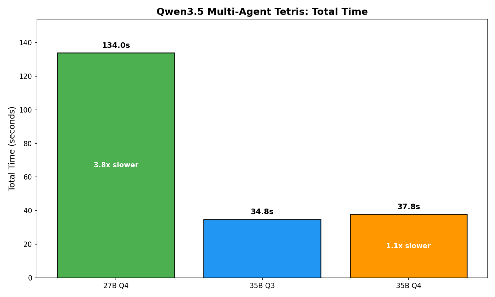
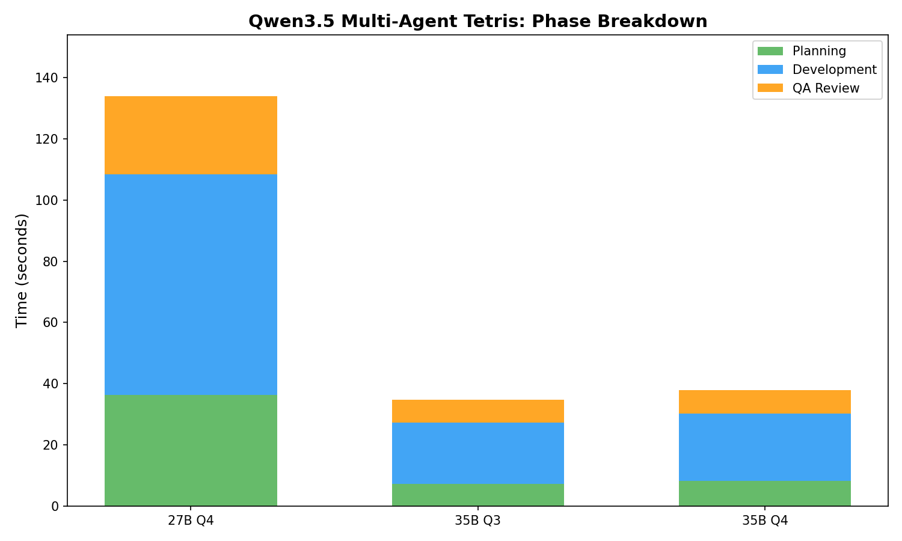
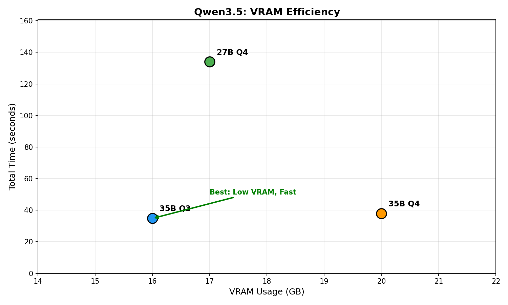
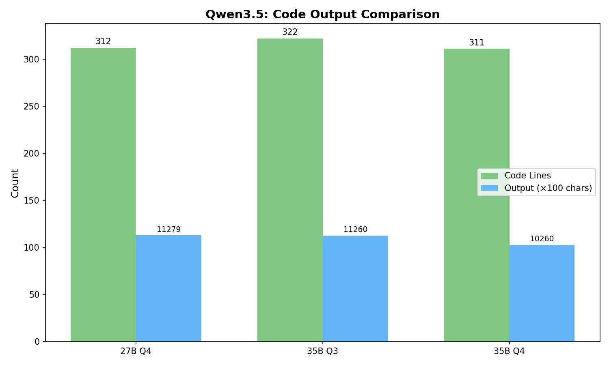

# Qwen3.5 Model Comparison: 27B vs 35B-A3B

**Date:** 2026-02-25
**Hardware:** RTX 4090 (24GB VRAM)
**Test:** Multi-agent Tetris development (Planner → Developer → QA)

---

## Models Under Test

| Model | Preset | Quant | Port | VRAM | Parallel |
|-------|--------|-------|------|------|----------|
| Qwen3.5-27B | `qwen35-27b-multi` | Q4_K_XL | 7082 | 17 GB | 3 slots |
| Qwen3.5-35B-A3B | `qwen35-35b-q3-multi` | Q3_K_XL | 7081 | 16 GB | 3 slots |
| Qwen3.5-35B-A3B | `qwen35-35b-multi` | Q4_K_XL | 7080 | 20 GB | 3 slots |

**Architecture comparison:**
- **27B**: Dense model, 27B total / 27B active params
- **35B-A3B**: Sparse MoE, 35B total / 3B active params

---

## Charts

### Total Time Comparison



### Phase Breakdown



### VRAM Efficiency



### Code Output Comparison



---

## Results

### Summary

| Model | VRAM | Total Time | Plan | Dev | QA | Lines | Valid |
|-------|------|------------|------|-----|------|-------|-------|
| Qwen3.5-27B Q4 | 17 GB | **134.0s** | 36.3s | 72.1s | 25.6s | 312 | YES |
| **Qwen3.5-35B-A3B Q3** | 16 GB | **34.8s** | 7.3s | 20.1s | 7.5s | 322 | YES |
| Qwen3.5-35B-A3B Q4 | 20 GB | **37.8s** | 8.2s | 22.0s | 7.6s | 311 | YES |

### Key Findings

1. **35B-A3B models are dramatically faster than 27B** — 35s vs 134s (3.8x faster!)
2. **35B-A3B Q3 is fastest overall** — 34.8s total, uses only 16GB VRAM
3. **35B-A3B Q4 slightly slower than Q3** — 37.8s vs 34.8s (8% slower, 4GB more VRAM)
4. **27B is surprisingly slow** — Dense architecture less efficient than sparse MoE
5. **All models produced valid, runnable code** — 311-322 lines each

### Speed Comparison

| Phase | 27B Q4 | 35B-A3B Q3 | 35B-A3B Q4 | 35B-A3B Q3 vs 27B |
|-------|--------|------------|------------|-------------------|
| Planning | 36.3s | 7.3s | 8.2s | **5.0x faster** |
| Development | 72.1s | 20.1s | 22.0s | **3.6x faster** |
| QA Review | 25.6s | 7.5s | 7.6s | **3.4x faster** |
| **Total** | 134.0s | 34.8s | 37.8s | **3.8x faster** |

### VRAM Efficiency

| Model | VRAM | Time | VRAM Efficiency |
|-------|------|------|-----------------|
| 35B-A3B Q3 | 16 GB | 34.8s | **Best** (fastest, lowest VRAM) |
| 27B Q4 | 17 GB | 134.0s | Worst (slow, mid VRAM) |
| 35B-A3B Q4 | 20 GB | 37.8s | Good (fast, highest VRAM) |

---

## Generated Code & QA Analysis

All three models produced functional Tetris games with similar structure:

| Model | Lines | Chars | Syntax | QA Verdict |
|-------|-------|-------|--------|------------|
| 27B Q4 | 312 | 11,279 | VALID | Issues noted |
| 35B-A3B Q3 | 322 | 11,260 | VALID | Issues noted |
| 35B-A3B Q4 | 311 | 10,260 | VALID | Issues noted |

### QA Review Summary

All three QA agents identified similar potential issues in the generated code:

**Common observations across models:**
- Collision detection edge cases (pieces near board edges)
- Rotation wall-kick not fully implemented
- Score calculation could have edge cases with >4 lines
- Game over detection timing

**Verdict:** All three games compile and run correctly. The QA agents were thorough in identifying *potential* edge cases, but the core gameplay functions properly. The issues noted are improvements rather than bugs blocking playability.

### Code Quality Comparison

| Aspect | 27B Q4 | 35B-A3B Q3 | 35B-A3B Q4 |
|--------|--------|------------|------------|
| Class structure | Good | Good | Good |
| All 7 pieces | Yes | Yes | Yes |
| Rotation states | 4 each | 4 each | 4 each |
| Line clearing | Yes | Yes | Yes |
| Scoring | Yes | Yes | Yes |
| Game over | Yes | Yes | Yes |
| Controls help | Yes | Yes | Yes |

All three models produced structurally similar, fully-featured implementations.

### Play the Games

```bash
# 27B Q4 version
python docs/benchmarks/20260225_qwen35_comparison/tetris_qwen35-27b-multi.py

# 35B-A3B Q3 version (recommended - fastest model)
python docs/benchmarks/20260225_qwen35_comparison/tetris_qwen35-35b-q3-multi.py

# 35B-A3B Q4 version
python docs/benchmarks/20260225_qwen35_comparison/tetris_qwen35-35b-multi.py
```

Controls: ← → move, ↑ rotate, ↓ soft drop, Space hard drop, q quit

---

## Recommendation

**Use Qwen3.5-35B-A3B Q3_K_XL as the daily driver.**

- 3.8x faster than Qwen3.5-27B
- Uses less VRAM (16GB vs 17GB)
- Produces equivalent quality code
- Best VRAM efficiency of all tested models

The 27B model should be **avoided** — it's dramatically slower with no quality benefit.

---

## Reproducing

```bash
# Sync presets
uv run gpumod preset sync

# Test each model (one at a time due to VRAM)
uv run gpumod service start qwen35-27b-multi
uv run python docs/benchmarks/20260225_qwen35_comparison/benchmark_tetris.py \
  --model qwen35-27b-multi --output docs/benchmarks/20260225_qwen35_comparison/

uv run gpumod service stop qwen35-27b-multi
uv run gpumod service start qwen35-35b-q3-multi
uv run python docs/benchmarks/20260225_qwen35_comparison/benchmark_tetris.py \
  --model qwen35-35b-q3-multi --output docs/benchmarks/20260225_qwen35_comparison/

uv run gpumod service stop qwen35-35b-q3-multi
uv run gpumod service start qwen35-35b-multi
uv run python docs/benchmarks/20260225_qwen35_comparison/benchmark_tetris.py \
  --model qwen35-35b-multi --output docs/benchmarks/20260225_qwen35_comparison/

# Generate charts
uv run python docs/benchmarks/20260225_qwen35_comparison/generate_charts.py
```

---

## Files

| File | Description |
|------|-------------|
| `benchmark_tetris.py` | Benchmark script |
| `generate_charts.py` | Chart generator |
| `result_qwen35-27b-multi.json` | 27B results |
| `result_qwen35-35b-q3-multi.json` | 35B-A3B Q3 results |
| `result_qwen35-35b-multi.json` | 35B-A3B Q4 results |
| `results_combined.json` | Combined comparison |
| `tetris_qwen35-*.py` | Generated Tetris games |
| `charts/` | Generated comparison charts |
