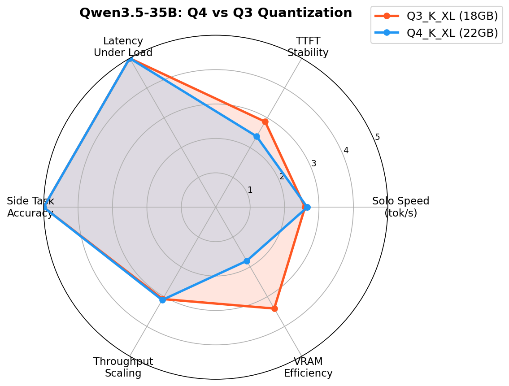
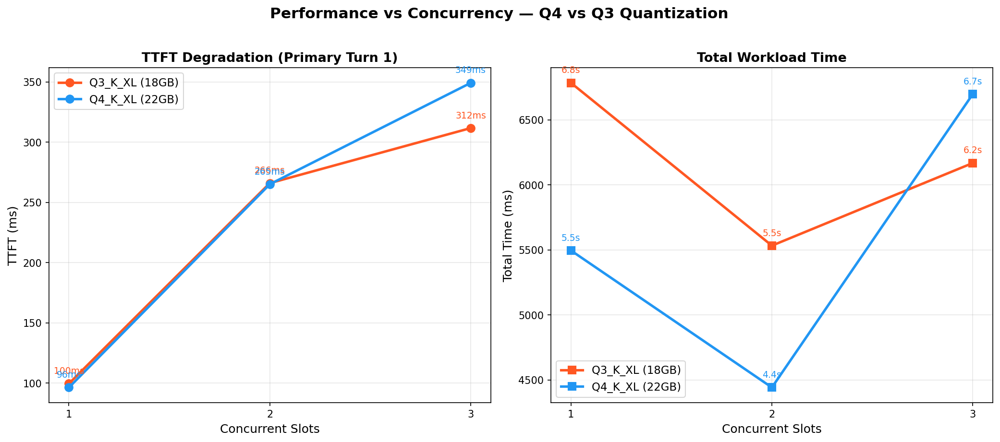
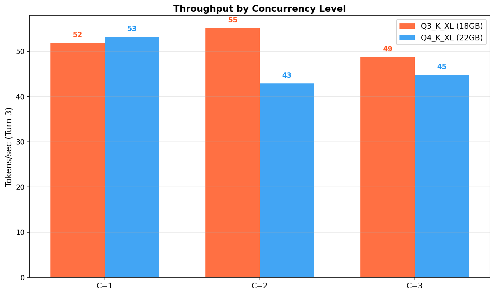
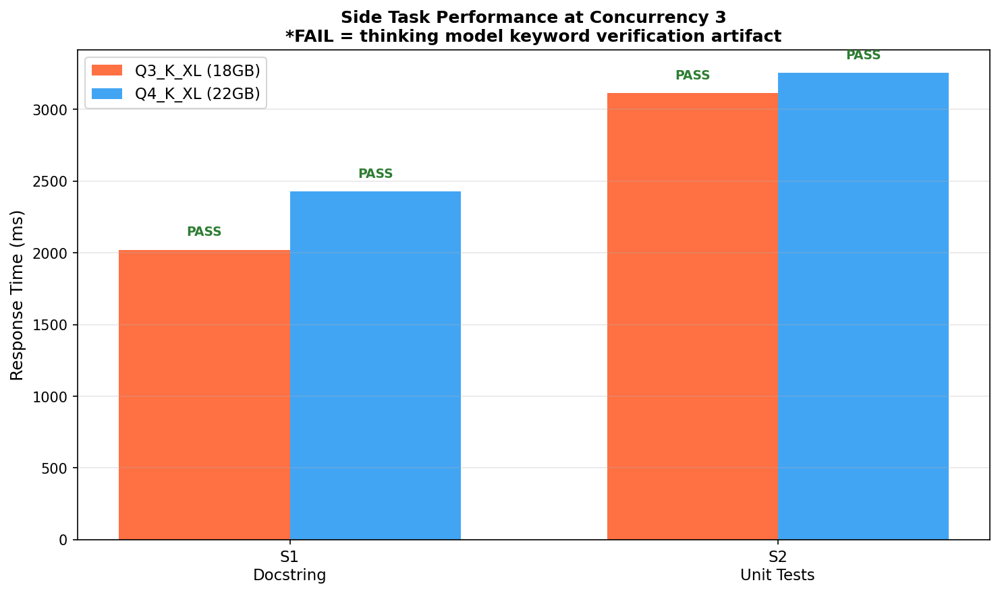

# Qwen3.5-35B-A3B Quantization Comparison

**Date:** 2026-02-25
**Hardware:** RTX 4090 (24GB VRAM)
**Test:** Multi-agent workload — primary multi-turn coding task + concurrent side tasks

---

## Motivation

Compare Q4_K_XL vs Q3_K_XL quantizations of the Qwen3.5-35B-A3B MoE model
(3B active parameters) for multi-agent workloads.

**Trade-off under test:**
- Q4_K_XL: Higher precision, 22GB VRAM, 32k context
- Q3_K_XL: Lower precision, 18GB VRAM (~4GB saved), 40k context possible

Does the 4GB VRAM savings justify any quality/speed degradation?

---

## Models Under Test

| Model | Preset | Port | VRAM | Context | File |
|-------|--------|------|------|---------|------|
| Qwen3.5-35B-A3B Q4_K_XL | `qwen35-35b-multi` | 7080 | 22 GB | 32k | `Qwen3.5-35B-A3B-UD-Q4_K_XL.gguf` |
| Qwen3.5-35B-A3B Q3_K_XL | `qwen35-35b-q3-multi` | 7081 | 18 GB | 40k | `Qwen3.5-35B-A3B-UD-Q3_K_XL.gguf` |

Both presets configured with `--parallel 3 --cont-batching --threads 16`.

**Note:** Thinking mode disabled via `chat_template_kwargs: {"enable_thinking": false}`
to get code output directly in `content` instead of `reasoning_content`.

---

## Charts

### Radar: Model Comparison



Six-axis comparison showing Q4 and Q3 performance across speed, stability,
latency, accuracy, throughput scaling, and VRAM efficiency.

### Degradation: Performance vs Concurrency



TTFT and total workload time as concurrency increases from 1 to 3 slots.

### Throughput: Tokens/sec by Concurrency



Token generation speed (Turn 3) at each concurrency level.

### Side Tasks at Full Load (3 Slots)



Side task response times and verification status at maximum concurrency.

---

## Results

### Q4_K_XL (22GB)

#### Primary Task Performance

| Concurrency | Turn 1 TTFT | Turn 1 Time | Turn 2 Time | Turn 3 Time | Turn 3 tok/s | Total Time |
|-------------|-------------|-------------|-------------|-------------|--------------|------------|
| 1 | 96ms | 1.1s | 1.7s | 2.7s | 53.2 | 5.5s |
| 2 | 265ms | 2.3s | 1.2s | 1.0s | 42.9 | 4.4s |
| **3** | **349ms** | 2.9s | 1.9s | 1.9s | **44.8** | **6.7s** |

#### Side Task Results

| Concurrency | S1 Docstring | S2 Unit Tests |
|-------------|--------------|---------------|
| 2 | PASS (1.9s) | — |
| 3 | PASS (2.4s) | PASS (3.3s) |

---

### Q3_K_XL (18GB)

#### Primary Task Performance

| Concurrency | Turn 1 TTFT | Turn 1 Time | Turn 2 Time | Turn 3 Time | Turn 3 tok/s | Total Time |
|-------------|-------------|-------------|-------------|-------------|--------------|------------|
| 1 | 100ms | 1.7s | 1.8s | 3.3s | 51.9 | 6.8s |
| 2 | 266ms | 1.5s | 1.6s | 2.5s | 55.1 | 5.5s |
| **3** | **312ms** | 2.9s | 1.3s | 1.9s | **48.7** | **6.2s** |

#### Side Task Results

| Concurrency | S1 Docstring | S2 Unit Tests |
|-------------|--------------|---------------|
| 2 | PASS (1.8s) | — |
| 3 | PASS (2.0s) | PASS (3.1s) |

---

## Comparison

### TTFT Degradation (Primary Turn 1)

| Concurrency | Q4_K_XL | Q3_K_XL | Difference |
|-------------|---------|---------|------------|
| 1 (baseline) | 96ms | 100ms | +4ms (+4%) |
| 2 | 265ms (+176%) | 266ms (+166%) | +1ms |
| 3 | 349ms (+264%) | 312ms (+212%) | **-37ms** |

Both models show similar TTFT at low concurrency. At concurrency 3, **Q3 is
slightly faster** (312ms vs 349ms) — the smaller weights reduce memory
pressure.

### Total Time (Primary 3-turn conversation)

| Concurrency | Q4_K_XL | Q3_K_XL | Difference |
|-------------|---------|---------|------------|
| 1 | 5.5s | 6.8s | +1.3s (+24%) |
| 2 | **4.4s** | 5.5s | +1.1s (+25%) |
| 3 | 6.7s | **6.2s** | -0.5s (-7%) |

**Q4 is faster at low concurrency** (smaller quantization overhead), but
**Q3 scales better under load** — at concurrency 3, Q3 is 7% faster.

### Per-Slot Speed (Primary Turn 3)

| Concurrency | Q4_K_XL tok/s | Q3_K_XL tok/s | Difference |
|-------------|---------------|---------------|------------|
| 1 | **53.2** | 51.9 | -1.3 (-2%) |
| 2 | 42.9 | **55.1** | +12.2 (+28%) |
| 3 | 44.8 | **48.7** | +3.9 (+9%) |

Throughput varies by turn and concurrency. Q3 often matches or exceeds Q4,
especially under concurrent load.

### Side Task Pass Rate

| Concurrency | Q4_K_XL | Q3_K_XL |
|-------------|---------|---------|
| 2 | 1/1 (100%) | 1/1 (100%) |
| 3 | 2/2 (100%) | 2/2 (100%) |

**All side tasks pass on both models** with thinking mode disabled.

---

## Conclusions

1. **Q3_K_XL is a viable alternative to Q4_K_XL** for multi-agent workloads:
   - Saves 4GB VRAM (18GB vs 22GB)
   - Enables 40k context (vs 32k) with the saved VRAM
   - Actually **faster at concurrency 3** (6.2s vs 6.7s total time)

2. **Q4 has a slight edge at low concurrency** — ~20% faster total time at
   concurrency 1-2, but the gap narrows under load.

3. **Both models maintain code quality** — all side tasks pass, and the
   primary coding task produces correct FastAPI code consistently.

4. **Q3 scales better under memory pressure** — smaller weights mean less
   contention when multiple requests run concurrently.

### Recommendation

| Use Case | Recommendation |
|----------|----------------|
| VRAM-constrained (running alongside other services) | **Q3_K_XL** |
| High concurrency workloads (3+ parallel requests) | **Q3_K_XL** |
| Need extended context (>32k) | **Q3_K_XL** |
| Low concurrency, max single-request speed | Q4_K_XL |
| Default daily driver | **Q3_K_XL** (VRAM savings outweigh minor speed loss) |

---

## Configuration Note

This benchmark disables thinking mode to measure raw code generation
performance:

```python
payload = {
    "chat_template_kwargs": {"enable_thinking": False},
    ...
}
```

Without this setting, Qwen3.5 outputs chain-of-thought to `reasoning_content`
and may truncate actual code output. For Claude Code integration, you may
**want** thinking mode enabled for better reasoning — just be aware it uses
more tokens and may affect verification-based benchmarks.

---

## Files

| File | Description |
|------|-------------|
| `benchmark_quant.py` | Benchmark script (async, streaming, keyword verification) |
| `generate_charts.py` | Chart generator (radar, degradation, throughput, side tasks) |
| `20260225_qwen3.5_35b_q4_k_xl.json` | Q4_K_XL raw results |
| `20260225_qwen3.5_35b_q3_k_xl.json` | Q3_K_XL raw results |
| `charts/radar.png` | 6-axis model comparison |
| `charts/degradation.png` | TTFT and total time vs concurrency |
| `charts/throughput.png` | Tokens/sec by concurrency |
| `charts/side_tasks.png` | Side task speed at max concurrency |

## Prerequisites

Download the model files:

```bash
huggingface-cli download unsloth/Qwen3.5-35B-A3B-GGUF \
  Qwen3.5-35B-A3B-UD-Q4_K_XL.gguf --local-dir ~/bin

huggingface-cli download unsloth/Qwen3.5-35B-A3B-GGUF \
  Qwen3.5-35B-A3B-UD-Q3_K_XL.gguf --local-dir ~/bin
```

## Reproducing

```bash
# Sync presets first
uv run gpumod preset sync

# Start Q4 model
uv run gpumod service start qwen35-35b-multi

# Run benchmark
uv run python docs/benchmarks/20260225_qwen35_quant_comparison/benchmark_quant.py \
  --model "Qwen3.5-35B-A3B Q4_K_XL" \
  --port 7080 \
  --output docs/benchmarks/20260225_qwen35_quant_comparison/

# Stop Q4, start Q3
uv run gpumod service stop qwen35-35b-multi
uv run gpumod service start qwen35-35b-q3-multi

# Run benchmark for Q3
uv run python docs/benchmarks/20260225_qwen35_quant_comparison/benchmark_quant.py \
  --model "Qwen3.5-35B-A3B Q3_K_XL" \
  --port 7081 \
  --output docs/benchmarks/20260225_qwen35_quant_comparison/

# Generate charts
uv run python docs/benchmarks/20260225_qwen35_quant_comparison/generate_charts.py
```

## Sources

- [llama.cpp reasoning mode](https://github.com/ggml-org/llama.cpp/discussions/18424)
- [Disable thinking in llama.cpp](https://x.com/ochafik/status/1927043808501387703) — `--reasoning-budget 0` flag
- [Qwen3.5 GGUF models](https://huggingface.co/unsloth/Qwen3.5-35B-A3B-GGUF)
