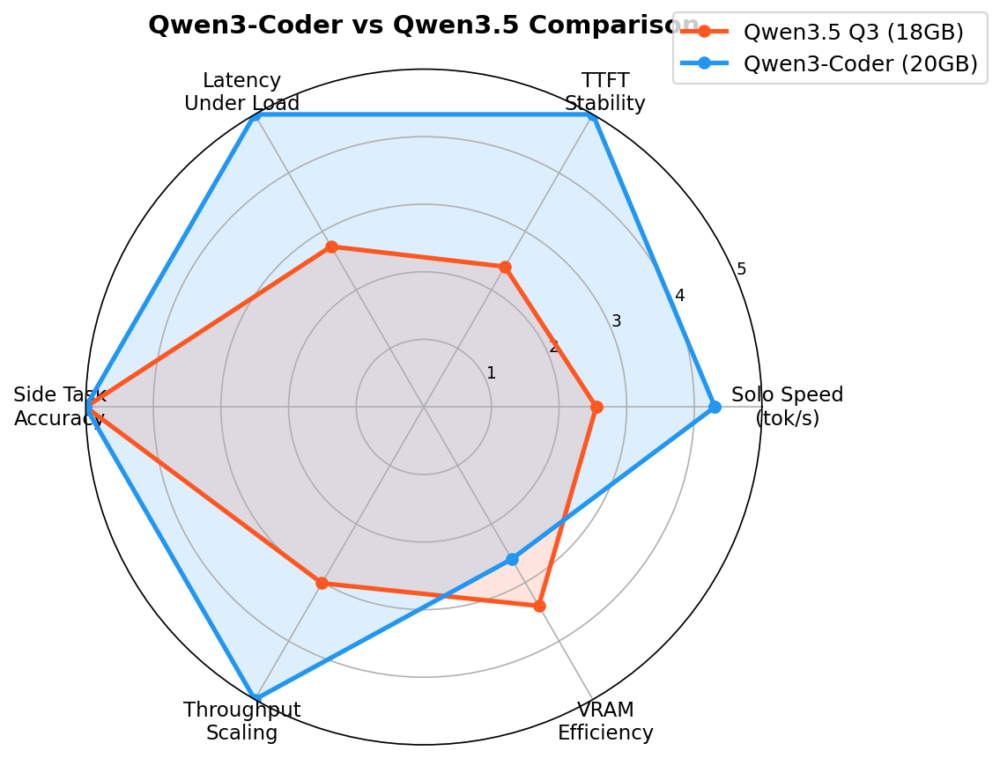
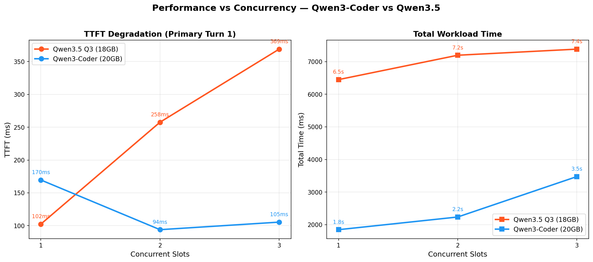
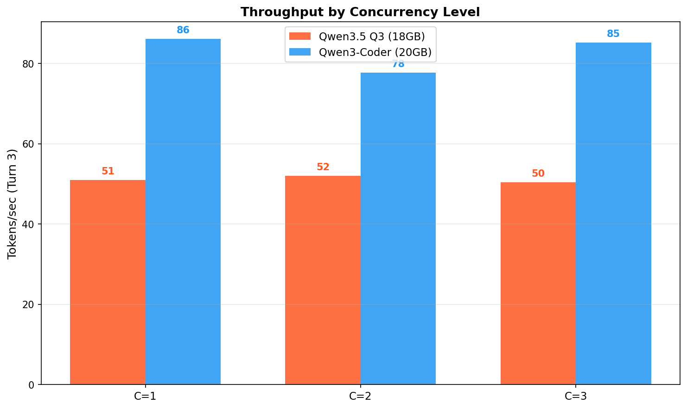
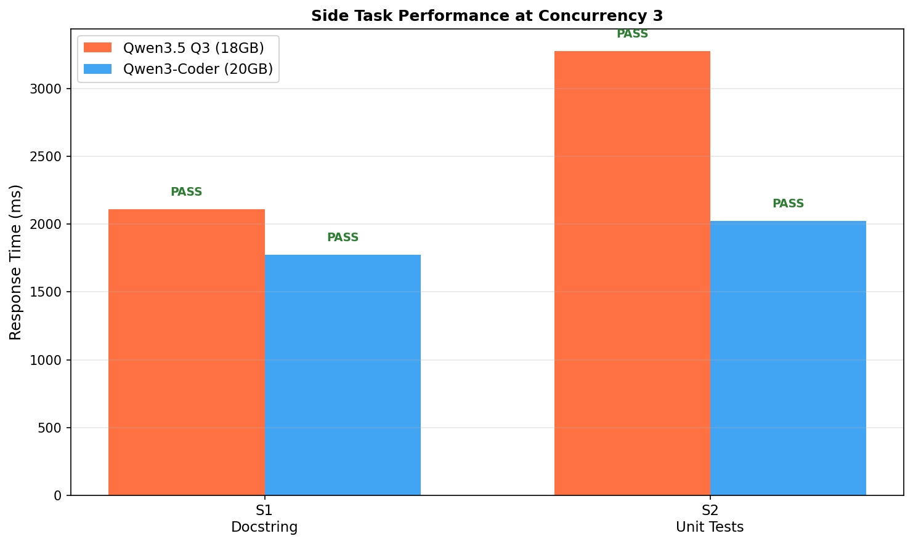

# Qwen3-Coder vs Qwen3.5-35B Comparison

**Date:** 2026-02-25
**Hardware:** RTX 4090 (24GB VRAM)
**Test:** Multi-agent workload — primary multi-turn coding task + concurrent side tasks

---

## Motivation

Compare **Qwen3-Coder-30B-A3B** (the current daily driver) against the newer
**Qwen3.5-35B-A3B Q3_K_XL** to determine if the upgrade is worthwhile.

**Key differences:**
- Qwen3-Coder: Optimized for code, Q4_K_M quantization (20GB VRAM)
- Qwen3.5: Newer general model, Q3_K_XL quantization (18GB VRAM)

Both have 3B active parameters (MoE architecture). **Fair comparison: both use 3 parallel slots.**

---

## Models Under Test

| Model | Preset | Port | VRAM | Context | Parallel Slots |
|-------|--------|------|------|---------|----------------|
| Qwen3-Coder-30B-A3B | `qwen3-coder-multi-p3` | 7070 | 20 GB | 40k | 3 |
| Qwen3.5-35B Q3_K_XL | `qwen35-35b-q3-multi` | 7081 | 18 GB | 40k | 3 |

---

## Charts

### Radar: Model Comparison



### Degradation: Performance vs Concurrency



### Throughput: Tokens/sec by Concurrency



### Side Tasks at Max Concurrency



---

## Results

### Summary

| Metric | Qwen3-Coder-30B | Qwen3.5-35B Q3 | Winner |
|--------|-----------------|----------------|--------|
| VRAM Usage | 20 GB | 18 GB | Qwen3.5 |
| Solo Speed (C1) | 86.1 tok/s | 51.0 tok/s | **Qwen3-Coder** |
| Speed at C3 | 85.2 tok/s | 50.4 tok/s | **Qwen3-Coder** |
| TTFT (C1) | 170ms | 102ms | Qwen3.5 |
| TTFT (C3) | 105ms | 369ms | **Qwen3-Coder** |
| Total Time (C3) | 3.5s | 7.4s | **Qwen3-Coder** |
| Side Tasks | 2/2 PASS | 2/2 PASS | Tie |

### Key Findings

1. **Qwen3-Coder is significantly faster** — 85.2 vs 50.4 tok/s at C3 (1.7x faster)
2. **Qwen3-Coder handles concurrency better** — 3.5s vs 7.4s total time at C3 (2.1x faster)
3. **Qwen3.5 has lower TTFT at C1** but degrades 3.6x under load (102→369ms)
4. **Qwen3-Coder TTFT improves under load** (170→105ms) — better batch efficiency
5. **Both pass all quality checks** — docstrings and unit tests verified

### Recommendation

**Keep Qwen3-Coder as the daily driver.** The newer Qwen3.5 saves 2GB VRAM but is:
- 1.7x slower per-request
- 2.1x slower for concurrent workloads
- TTFT degrades 3.6x under load (vs improving for Qwen3-Coder)

Use Qwen3.5 Q3 only when VRAM is severely constrained.

### Detailed Results

#### Concurrency 1 (Solo)

| Model | TTFT | Turn 3 tok/s | Total Time |
|-------|------|--------------|------------|
| Qwen3-Coder | 170ms | 86.1 | 1.84s |
| Qwen3.5 Q3 | 102ms | 51.0 | 6.45s |

#### Concurrency 3 (Max Load)

| Model | TTFT | Turn 3 tok/s | Total Time |
|-------|------|--------------|------------|
| Qwen3-Coder | 105ms | 85.2 | 3.47s |
| Qwen3.5 Q3 | 369ms | 50.4 | 7.39s |

#### Side Tasks at C3

| Task | Qwen3-Coder | Qwen3.5 Q3 |
|------|-------------|------------|
| S1 Docstring | 1776ms PASS | 2110ms PASS |
| S2 Unit Tests | 2025ms PASS | 3279ms PASS |

---

## Prerequisites

Download the model files:

```bash
# Qwen3-Coder (if not already downloaded)
huggingface-cli download Qwen/Qwen3-Coder-30B-A3B-Instruct-GGUF \
  Qwen3-Coder-30B-A3B-Instruct-Q4_K_M.gguf --local-dir ~/bin

# Qwen3.5 Q3
huggingface-cli download unsloth/Qwen3.5-35B-A3B-GGUF \
  Qwen3.5-35B-A3B-UD-Q3_K_XL.gguf --local-dir ~/bin
```

## Reproducing

```bash
# Sync presets first
uv run gpumod preset sync

# Start Qwen3-Coder model (3 parallel slots for fair comparison)
uv run gpumod service start qwen3-coder-multi-p3

# Run benchmark
uv run python docs/benchmarks/20260225_qwen3_vs_qwen35/benchmark_models.py \
  --model "Qwen3-Coder-30B" \
  --port 7070 \
  --output docs/benchmarks/20260225_qwen3_vs_qwen35/

# Stop Qwen3-Coder, start Qwen3.5
uv run gpumod service stop qwen3-coder-multi-p3
uv run gpumod service start qwen35-35b-q3-multi

# Run benchmark for Qwen3.5
uv run python docs/benchmarks/20260225_qwen3_vs_qwen35/benchmark_models.py \
  --model "Qwen3.5-35B Q3_K_XL" \
  --port 7081 \
  --output docs/benchmarks/20260225_qwen3_vs_qwen35/

# Generate charts
uv run python docs/benchmarks/20260225_qwen3_vs_qwen35/generate_charts.py
```

---

## Bonus: Multi-Agent Tetris Test

To demonstrate Qwen3-Coder's practical capability, we ran a multi-agent workflow using the 3 parallel slots:

| Agent | Role | Output |
|-------|------|--------|
| Planner | Architecture design | 1,441 chars |
| Developer | Implementation | 9,670 chars (284 lines) |
| QA | Code review | 2,024 chars |

**Result:** Fully functional terminal Tetris game produced in ~2 minutes.

Features implemented:
- All 7 standard pieces (I, O, T, S, Z, J, L) with rotation
- Collision detection, line clearing, scoring
- Level progression, next piece preview
- Full curses-based rendering

```bash
# Run the generated game
python docs/benchmarks/20260225_qwen3_vs_qwen35/tetris_game.py
```

See [tetris_agent_report.md](tetris_agent_report.md) for full details.

---

## Files

| File | Description |
|------|-------------|
| `benchmark_models.py` | Benchmark script |
| `generate_charts.py` | Chart generator |
| `20260225_qwen3_coder_30b.json` | Qwen3-Coder results |
| `20260225_qwen3.5_35b_q3_k_xl.json` | Qwen3.5 Q3 results |
| `charts/` | Generated comparison charts |
| `test_tetris_agents.py` | Multi-agent orchestration script |
| `tetris_game.py` | Generated Tetris game |
| `tetris_agent_report.md` | Multi-agent test report |
