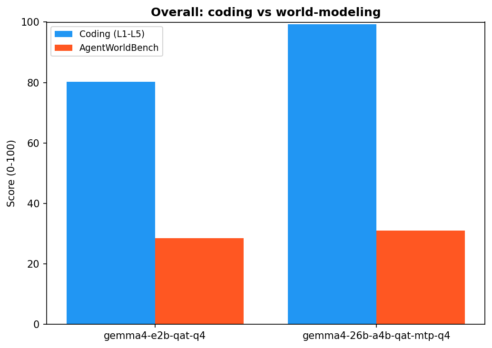
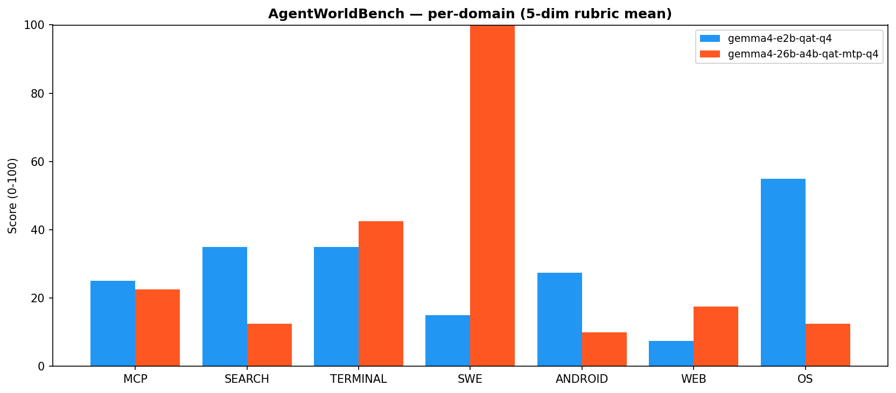
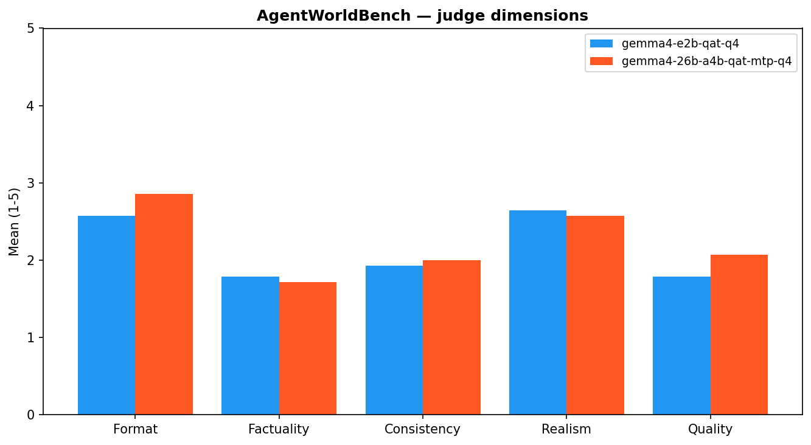
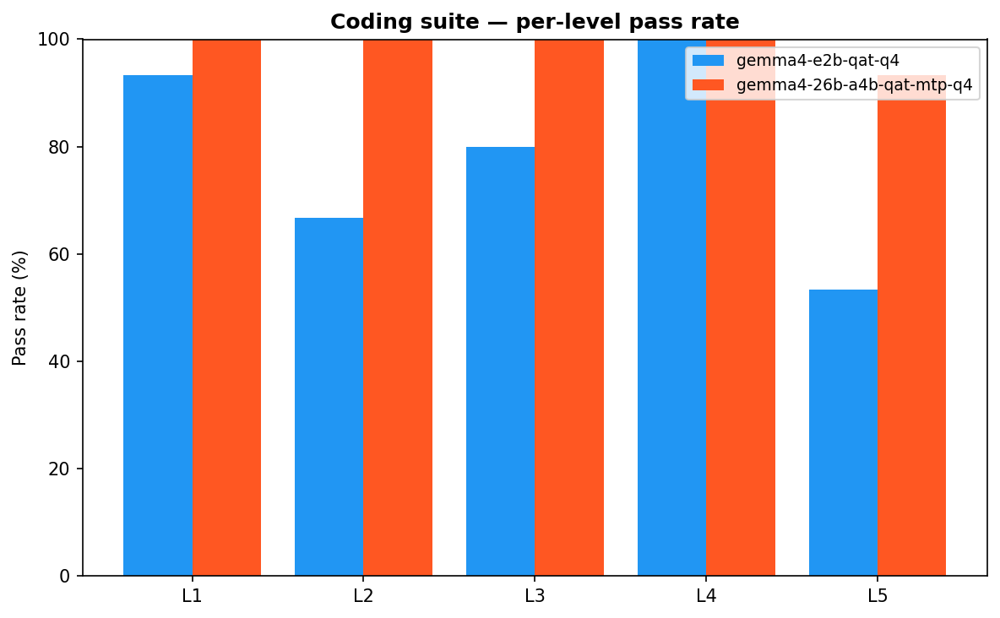
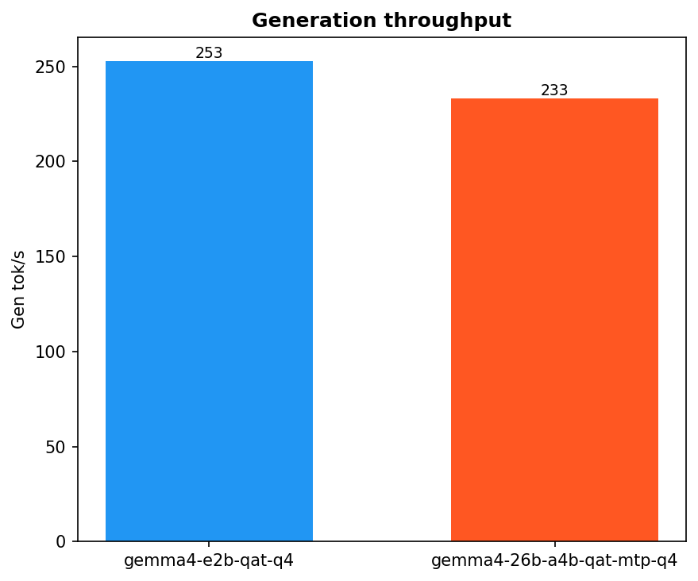

# Unified — Gemma 4 E2B (QAT Q4_K_XL) vs 26B-A4B-QAT-MTP — coding L1-L5 + AgentWorldBench (RTX 4090, b9784)

**Date:** 2026-06-25
**Tickets:** gpumod-kpmq (epic — extend the bench to AgentWorldBench + unified report); gpumod-kpmq.1 (AgentWorldBench eval harness), gpumod-kpmq.5 (standard E2B QAT Q4 preset)
**Question:** Two things at once. (1) Does the daily-driver `gemma4-26b-a4b-qat-mtp-q4` keep its coding crown while we measure a *new* axis — world-modeling — on the same binary? (2) Is the tiny `gemma4-e2b-qat-q4` (2.3 B, 2.4 GB) a viable cheap engine to drive the AgentWorldBench pipeline (harness dev + fine-tune-data generation in `local-llm-lab`) without paying for the 26 B?

This is the first bench to run **both axes** — the v2 coding suite (L1-L5) *and* AgentWorldBench world-modeling — for every model, in one report.

## TL;DR

| Model | Coding | σ | Min/Max | 95% CI | TPS | AgentWorld | VRAM idle | GGUF | Verdict |
|---|---:|---:|---:|---:|---:|---:|---:|---:|---|
| gemma4-e2b-qat-q4 | 80.3 | 19.86 | 40/100 | [69.4, 91.3] | **252.9** | 28.6 | **2553 MB** | **2.4 GB** | **Cheap AgentWorldBench engine — world-models within 2.5 pts of the 26 B at 1/8 the VRAM; the fine-tune target** |
| gemma4-26b-a4b-qat-mtp-q4 | **99.3** | 2.58 | 90/100 | [97.9, 100.8] | 233.2 | **31.1** | 21323 MB | 13.3 GB | **Keep as daily-driver — coding crown intact; world-modeling weak (scale is not the lever)** |

**Three headlines:**

1. **The daily-driver keeps its coding crown — and is even the marginally-better world-modeler.** `gemma4-26b-a4b-qat-mtp-q4` scores **99.3** on the coding suite (L5 14/15) and **31.1** on AgentWorldBench. It dominates coding exactly as expected and edges the small model on world-modeling too, so adding the world-modeling axis gives **no reason to change the daily-driver**.
2. **World-modeling is flat across an 11× scale gap.** E2B-Q4 (2.3 B) scores **28.6**; mtp-q4 (26 B) scores **31.1** — a **2.5-point** spread despite ~11× the parameters and ~8× the VRAM. Out-of-the-box Gemma world-modeling is **~30/100 regardless of size**. **Scale buys coding (80.3 → 99.3), not world-modeling (28.6 → 31.1).** This is the central evidence for the fine-tuning thesis: to make Gemma a world model you must *fine-tune on AgentWorld-style trajectories*, not scale up.
3. **E2B-Q4 is the right engine for the AgentWorldBench pipeline.** At **2.4 GB / 2553 MB idle / 252.9 TPS**, with a 128 K context that fits AgentWorldBench's largest prompts (full **14/14** coverage), it world-models within 2.5 points of the 26 B. For harness dev and fine-tune-data generation in `local-llm-lab` you do not need the big model — and because the fine-tune target is itself E2B (cheap to train *and* serve), its coding score (80.3) is the **retention floor** the fine-tune must not erode.

## Charts

*Overall: coding vs world-modeling — the gap is enormous on coding (80.3 vs 99.3) and negligible on world-modeling (28.6 vs 31.1).*

*AgentWorldBench per-domain (0-100) — different profiles: mtp-q4 spikes on SWE (its coding strength bleeds into software-engineering trajectories) but is poor on os/search; E2B is flatter. Per-domain n=2, so read these as texture, not signal — the Overall is the robust number.*

*AgentWorldBench judge dimensions (1-5) — both models format plausibly (Format 2.6-2.9, Realism ~2.6) but get the **facts** wrong (Factuality ~1.75/5). Right shape, wrong content: the classic non-world-model failure.*

*Coding suite per-level pass rate — mtp-q4 is near-perfect through L5; E2B holds L1/L4 but degrades on the hardest composition level (L5 8/15).*

*Generation throughput (TPS) — E2B-Q4 252.9 vs mtp-q4 233.2. The 2.3 B is faster, but MTP keeps the 26 B remarkably close.*

## Setup

| Component | Value |
|---|---|
| GPU | NVIDIA GeForce RTX 4090, 24564 MiB |
| Host RAM | 31 GiB |
| **llama.cpp** | **version 9784 (`8be759e6f`)** — both arms on this one binary |
| Stability defaults | `GGML_CUDA_NO_PINNED=1` (template default); preflight RAM/VRAM checks |
| Isolation | `gpumod mode switch blank` before the run; one arm GPU-resident at a time (see [run_bench.sh](run_bench.sh)) |

## Models tested

| Model | Source | Architecture | Quant | GGUF | Sampler | Port |
|---|---|---|---|---:|---|---:|
| `gemma4-e2b-qat-q4` | `unsloth/gemma-4-E2B-it-qat-GGUF` | dense E2B (~2.3 B effective) | QAT UD-Q4_K_XL | 2.4 GB | GEMMA_CODING | 7113 |
| `gemma4-26b-a4b-qat-mtp-q4` | `unsloth/gemma-4-26B-A4B-it-qat-GGUF` | MoE 26B / A4B + MTP | QAT UD-Q4_K_XL | 13.3 GB | GEMMA_CODING | 7110 |

E2B-Q4 is the **standard** (non-mobile) QAT tier — Unsloth's recommended quality point (98.16 % top-1). It is **not** the mobile repo's UD-Q2_K_XL (2-bit), which is degenerate on coding (rambles to the token cap). See [presets/llm/gemma4-e2b-qat-q4.yaml](../../../presets/llm/gemma4-e2b-qat-q4.yaml) and <https://unsloth.ai/docs/models/gemma-4/qat>.

## Methodology

Two independent axes, each model started via `gpumod service start`, polled `/health`, run, then stopped + quiesced. Only one arm is GPU-resident at a time.

### Axis 1 — coding suite (L1-L5)

v2 coding suite (`scripts/run_qwen36_benchmark.py`), 15 iterations/arm, 5 levels, `PytestValidator`:

| Level | Task | Points |
|---|---|---:|
| L1 | Basic queue (add/get, FIFO) | 25 |
| L2 | Retry with exponential backoff | 25 |
| L3 | Priority scheduling | 25 |
| L4 | Find & fix concurrency bug | 15 |
| L5 | Compose Job + RetryPolicy + JobQueue (source-inspection) | 10 |

### Axis 2 — AgentWorldBench (world-modeling)

`scripts/run_agentworld_benchmark.py` (harness in `src/gpumod/benchmarks/agentworld/`), the [Qwen/AgentWorldBench](https://huggingface.co/datasets/Qwen/AgentWorldBench) dataset, 7 domains (mcp, search, terminal, swe, android, web, os), `--sample 2` → **14 samples/arm**. The eval is **two-phase**, and the two phases talk to different things:

- **Generation** (the model-under-test): an OpenAI client → the **local gpumod-served endpoint** (`http://localhost:<port>/v1`). Given the action history + current action, the model predicts the *next environment observation*.
- **Judge**: **`claude -p --model opus`** (Claude Code CLI, subscription auth — **no API key, no proxy**). It scores the prediction against the ground-truth observation on five dimensions (Format, Factuality, Consistency, Realism, Quality, 1-5), mapped to 0-100 as `(mean-1)/4×100`.

## Coding suite (L1-L5)

Per-level pass counts (of 15 iterations) and mean score.

| Model | L1 | L2 | L3 | L4 | L5 | Score |
|---|---:|---:|---:|---:|---:|---:|
| gemma4-e2b-qat-q4 | 14/15 | 10/15 | 12/15 | 15/15 | 8/15 | 80.3 |
| gemma4-26b-a4b-qat-mtp-q4 | 15/15 | 15/15 | 15/15 | 15/15 | 14/15 | 99.3 |

The 26 B is effectively saturated (one L5 miss in 75 level-attempts). The 2.3 B is **respectable for its size** — it holds L1 and L4 outright and only collapses on L5 (multi-component composition, the hardest level). The σ 19.86 reflects that L2/L3/L5 are coin-flips for it.

## AgentWorldBench (world-modeling)

Five-dimensional reference-grounded judge, 0-100 per domain. **n = 2 per domain (14 total)** — treat per-domain cells as texture; the **Overall** column (n=14) is the robust signal.

| Model | MCP | SEARCH | TERMINAL | SWE | ANDROID | WEB | OS | Overall | Coverage |
|---|---:|---:|---:|---:|---:|---:|---:|---:|---:|
| gemma4-e2b-qat-q4 | 25.0 | 35.0 | 35.0 | 15.0 | 27.5 | 7.5 | 55.0 | 28.6 | 14/14 |
| gemma4-26b-a4b-qat-mtp-q4 | 22.5 | 12.5 | 42.5 | 100.0 | 10.0 | 17.5 | 12.5 | 31.1 | 14/14 |

### Judge dimensions (mean 1-5)

| Model | Format | Factuality | Consistency | Realism | Quality | Judge |
|---|---:|---:|---:|---:|---:|---|
| gemma4-e2b-qat-q4 | 2.57 | 1.79 | 1.93 | 2.64 | 1.79 | opus |
| gemma4-26b-a4b-qat-mtp-q4 | 2.86 | 1.71 | 2.00 | 2.57 | 2.07 | opus |

## Why the scores look like this

- **The 2.5-point world-modeling gap across 11× scale is the whole story.** If world-modeling tracked scale, the 26 B would pull far ahead, as it does on coding (+19 points). It doesn't (+2.5). Both Gemma variants are simply **not trained as world models**, and adding parameters does not conjure that capability — it has to be *taught*. That is precisely the `local-llm-lab` fine-tune thesis, now quantified.
- **The judge dimensions show the failure mode.** Both models are decent on **Format (2.6-2.9)** and **Realism (~2.6)** — the predicted observations *look* like valid environment output — but weak on **Factuality (~1.75)** and **Quality (~1.8-2.1)**: they hallucinate *what the environment actually does next*. Right shape, wrong content. A world model has to be factually grounded in the simulated environment's dynamics, which neither is out-of-box.
- **mtp-q4's SWE=100 is its coding strength leaking in, not world-modeling.** Its single standout domain is software-engineering trajectories — which read like code, where it is near-perfect. Strip SWE and its other six domains average ~19. So even the 26 B's small lead is mostly "SWE looks like code," not general world-modeling. (n=2/domain — do not over-read individual cells.)
- **E2B's flatter profile (os 55, search/terminal 35) at the same overall** reinforces the point: the two reach ~30 by different routes, neither by actually modeling environments well.

## Methodology caveats

- **E2B = standard QAT UD-Q4_K_XL** (4-bit, ~2.3 B effective) — the recommended tier, *not* the degenerate 2-bit mobile variant.
- **Judge = `claude -p` (opus)**, Claude Code subscription, **no API key, no proxy**. Generation is the local gpumod endpoint; the two are independent.
- **AgentWorldBench n = 2/domain (14/arm).** Enough for a stable *Overall*; per-domain cells are noisy. A larger `--sample` would tighten the per-domain breakdown (it would not move the headline: world-modeling is flat across scale).
- **Both axes on b9784, both arms re-run** — no reuse of older-binary JSON. The comparison is binary-clean.
- **VRAM is steady-state idle**, not a true peak.
- **Samplers:** both use GEMMA_CODING (temp 1.0 / top_k 64) per Google's card — same family, so the cross-model comparison carries no sampler caveat here.

## Recommendation

- **Daily-driver: keep `gemma4-26b-a4b-qat-mtp-q4` unchanged.** 99.3 coding (L5 14/15) at 233 TPS; the new world-modeling axis gives no reason to swap. Its world-modeling (31.1) is weak, but so is every untuned Gemma's — that is a fine-tune problem, not a model-selection one.
- **AgentWorldBench pipeline (harness + fine-tune-data generation in `local-llm-lab`): use `gemma4-e2b-qat-q4`.** It world-models within 2.5 points of the 26 B at **1/8 the idle VRAM**, runs at 252.9 TPS, and its 128 K context gives full 14/14 coverage. Generation does not need the big model.
- **The fine-tune is justified and its target is E2B.** Both variants sit at ~30/100 world-modeling out-of-box and **scale does not move it**, so fine-tuning on AgentWorld trajectories is the only lever. Target E2B (cheap to train *and* serve). Its coding score here — **80.3** — is the **retention floor**: the distill/QLoRA run in `local-llm-lab` must lift world-modeling *without* dropping below it (hence the mixed-objective / coding-replay plan in that note). This bench is the pre-fine-tune baseline to measure the run against.

## Files

- [run_bench.sh](run_bench.sh) — 2-arm driver (both arms on b9784), then the unified-report generator
- [result_gemma4-e2b-qat-q4.json](result_gemma4-e2b-qat-q4.json), [result_gemma4-26b-a4b-qat-mtp-q4.json](result_gemma4-26b-a4b-qat-mtp-q4.json) — coding
- [result_agentworld_gemma4-e2b-qat-q4.json](result_agentworld_gemma4-e2b-qat-q4.json), [result_agentworld_gemma4-26b-a4b-qat-mtp-q4.json](result_agentworld_gemma4-26b-a4b-qat-mtp-q4.json) — AgentWorldBench (per-sample predictions + judge dimensions)
- [charts/](charts/) — overall, agentworld_domains, agentworld_dimensions, coding_levels, tps

## Related

- gpumod-kpmq (epic) — extend the bench to AgentWorldBench + unified report; gpumod-kpmq.1 (eval harness), gpumod-kpmq.5 (E2B QAT Q4 preset)
- [docs/benchmarks/20260625_agentworld_35b_a3b/README.md](../20260625_agentworld_35b_a3b/README.md) — the coding-only AgentWorld bench; format + methodology reference for this report
- `local-llm-lab/.notes/gemma4-agentworld-distill-finetune.md` — the fine-tune plan this baseline feeds (Claude `claude -p` data-gen + Unsloth QLoRA, coding-retention objective)
